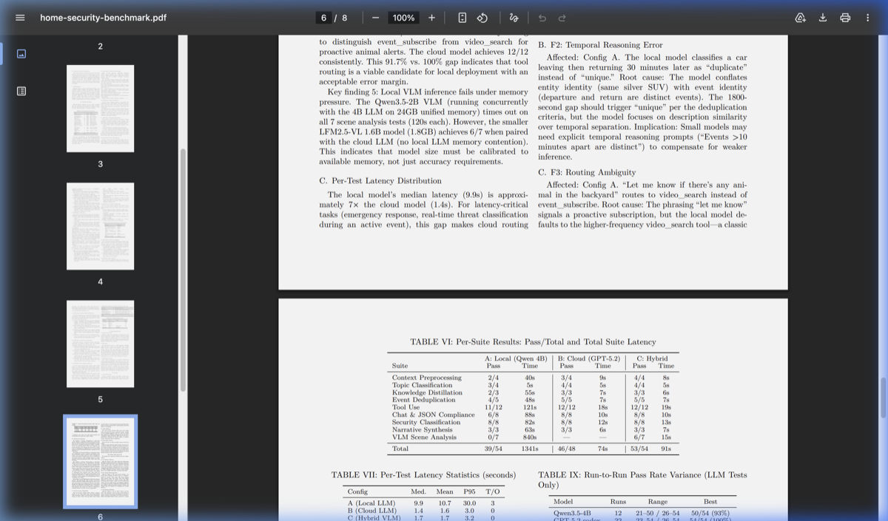

<div align="center">
<h1>DeepCamera — Open-Source AI Camera Skills Platform</h1>

<p>DeepCamera's open-source skills give your cameras AI — VLM scene analysis, object detection, person re-identification, all running locally with models like Qwen, DeepSeek, SmolVLM, and LLaVA. Built on proven facial recognition, RE-ID, fall detection, and CCTV/NVR surveillance monitoring, the skill catalog extends these machine learning capabilities with modern AI. All inference runs locally for maximum privacy.</p>

<p>
    <a href="https://join.slack.com/t/sharpai/shared_invite/zt-1nt1g0dkg-navTKx6REgeq5L3eoC1Pqg">
        
    </a>
    <a href="https://github.com/SharpAI/DeepCamera/issues">
        
    </a>
    <a href="https://github.com/SharpAI/DeepCamera/releases">
        
    </a>
    <a href="https://pypi.python.org/pypi/sharpai-hub">
        
    </a>
    <a href="https://pepy.tech/project/sharpai-hub">
        
    </a>
</p>
</div>

---

<div align="center">

### 🛡️ Introducing [SharpAI Aegis](https://www.sharpai.org) — Desktop App for DeepCamera

**Use DeepCamera's AI skills through a desktop app with LLM-powered setup, agent chat, and smart alerts — connected to your mobile via Discord / Telegram / Slack.**

[SharpAI Aegis](https://www.sharpai.org) is the desktop companion for DeepCamera. It uses LLM to automatically set up your environment, configure camera skills, and manage the full AI pipeline — no manual Docker or CLI required. It also adds an intelligent agent layer: persistent memory, agentic chat with your cameras, AI video generation, voice (TTS), and conversational messaging via Discord / Telegram / Slack.

[**📦 Download SharpAI Aegis →**](https://www.sharpai.org)

</div>

<table>
<tr>
<td width="50%">
<p align="center"><b>Run Local VLMs from HuggingFace — Even on Mac Mini 8GB</b></p>

<p align="center"><em>Download and run SmolVLM2, Qwen-VL, LLaVA, MiniCPM-V locally. Your AI security camera agent sees through these eyes.</em></p>
</td>
<td width="50%">
<p align="center"><b>Chat with Your AI Camera Agent</b></p>

<p align="center"><em>"Who was at the door?" — Your agent searches footage, reasons about what happened, and answers with timestamps and clips.</em></p>
</td>
</tr>
</table>

---

## 🗺️ Roadmap

- [x] **Skill architecture** — pluggable `SKILL.md` interface for all capabilities
- [x] **Skill Store UI** — browse, install, and configure skills from Aegis
- [x] **AI/LLM-assisted skill installation** — community-contributed skills installed and configured via AI agent
- [x] **GPU / NPU / CPU (AIPC) aware installation** — auto-detect hardware, install matching frameworks, convert models to optimal format
- [x] **Hardware environment layer** — shared [`env_config.py`](skills/lib/env_config.py) for auto-detection + model optimization across NVIDIA, AMD, Apple Silicon, Intel, and CPU
- [ ] **Skill development** — 19 skills across 10 categories, actively expanding with community contributions

## 🧩 Skill Catalog

Each skill is a self-contained module with its own model, parameters, and [communication protocol](docs/skill-development.md). See the [Skill Development Guide](docs/skill-development.md) and [Platform Parameters](docs/skill-params.md) to build your own.

| Category | Skill | What It Does | Status |
|----------|-------|--------------|:------:|
| **Detection** | [`yolo-detection-2026`](skills/detection/yolo-detection-2026/) | Real-time 80+ class detection — auto-accelerated via TensorRT / CoreML / OpenVINO / ONNX | ✅|
| **Analysis** | [`home-security-benchmark`](skills/analysis/home-security-benchmark/) | [143-test evaluation suite](#-homesec-bench--how-secure-is-your-local-ai) for LLM & VLM security performance | ✅ |
| **Privacy** | [`depth-estimation`](skills/transformation/depth-estimation/) | [Real-time depth-map privacy transform](#-privacy--depth-map-anonymization) — anonymize camera feeds while preserving activity | ✅ |
| **Annotation** | [`sam2-segmentation`](skills/annotation/sam2-segmentation/) | Click-to-segment with pixel-perfect masks | 📐 |
| | [`dataset-annotation`](skills/annotation/dataset-annotation/) | AI-assisted labeling → COCO export | 📐 |
| **Training** | [`model-training`](skills/training/model-training/) | Agent-driven YOLO fine-tuning — annotate, train, export, deploy | 📐 |
| **Automation** | [`mqtt`](skills/automation/mqtt/) · [`webhook`](skills/automation/webhook/) · [`ha-trigger`](skills/automation/ha-trigger/) | Event-driven automation triggers | 📐 |
| **Integrations** | [`homeassistant-bridge`](skills/integrations/homeassistant-bridge/) | HA cameras in ↔ detection results out | 📐 |

> ✅ Ready · 🧪 Testing · 📐 Planned

> **Registry:** All skills are indexed in [`skills.json`](skills.json) for programmatic discovery.


## 🚀 Getting Started with [SharpAI Aegis](https://www.sharpai.org)

The easiest way to run DeepCamera's AI skills. Aegis connects everything — cameras, models, skills, and you.

- 📷 **Connect cameras in seconds** — add RTSP/ONVIF cameras, webcams, or iPhone cameras for a quick test
- 🤖 **Built-in local LLM & VLM** — llama-server included, no separate setup needed
- 📦 **One-click skill deployment** — install skills from the catalog with AI-assisted troubleshooting
- 🔽 **One-click HuggingFace downloads** — browse and run Qwen, DeepSeek, SmolVLM, LLaVA, MiniCPM-V
- 📊 **Find the best VLM for your machine** — benchmark models on your own hardware with HomeSec-Bench
- 💬 **Talk to your guard** — via Telegram, Discord, or Slack. Ask what happened, tell it what to watch for, get AI-reasoned answers with footage.


## 🎯 YOLO 2026 — Real-Time Object Detection

State-of-the-art detection running locally on **any hardware**, fully integrated as a [DeepCamera skill](skills/detection/yolo-detection-2026/).

### YOLO26 Models

YOLO26 (Jan 2026) eliminates NMS and DFL for cleaner exports and lower latency. Pick the size that fits your hardware:

| Model | Params | Latency (optimized) | Use Case |
|-------|--------|:-------------------:|----------|
| **yolo26n** (nano) | 2.6M | ~2ms | Edge devices, real-time on CPU |
| **yolo26s** (small) | 11.2M | ~5ms | Balanced speed & accuracy |
| **yolo26m** (medium) | 25.4M | ~12ms | Accuracy-focused |
| **yolo26l** (large) | 52.3M | ~25ms | Maximum detection quality |

All models detect **80+ COCO classes**: people, vehicles, animals, everyday objects.

### Hardware Acceleration

The shared [`env_config.py`](skills/lib/env_config.py) **auto-detects your GPU** and converts the model to the fastest native format — zero manual setup:

| Your Hardware | Optimized Format | Runtime | Speedup vs PyTorch |
|---------------|-----------------|---------|:------------------:|
| **NVIDIA GPU** (RTX, Jetson) | TensorRT `.engine` | CUDA | **3-5x** |
| **Apple Silicon** (M1–M4) | CoreML `.mlpackage` | ANE + GPU | **~2x** |
| **Intel** (CPU, iGPU, NPU) | OpenVINO IR `.xml` | OpenVINO | **2-3x** |
| **AMD GPU** (RX, MI) | ONNX Runtime | ROCm | **1.5-2x** |
| **Any CPU** | ONNX Runtime | CPU | **~1.5x** |

### Aegis Skill Integration

Detection runs as a **parallel pipeline** alongside VLM analysis — never blocks your AI agent:

```
Camera → Frame Governor → detect.py (JSONL) → Aegis IPC → Live Overlay
                5 FPS           ↓
                          perf_stats (p50/p95/p99 latency)
```

- 🖱️ **Click to setup** — one button in Aegis installs everything, no terminal needed
- 🤖 **AI-driven environment config** — autonomous agent detects your GPU, installs the right framework (CUDA/ROCm/CoreML/OpenVINO), converts models, and verifies the setup
- 📺 **Live bounding boxes** — detection results rendered as overlays on RTSP camera streams
- 📊 **Built-in performance profiling** — aggregate latency stats (p50/p95/p99) emitted every 50 frames
- ⚡ **Auto start** — set `auto_start: true` to begin detecting when Aegis launches

📖 [Full Skill Documentation →](skills/detection/yolo-detection-2026/SKILL.md)

## 🔒 Privacy — Depth Map Anonymization

Watch your cameras **without seeing faces, clothing, or identities**. The [depth-estimation skill](skills/transformation/depth-estimation/) transforms live feeds into colorized depth maps using [Depth Anything v2](https://github.com/DepthAnything/Depth-Anything-V2) — warm colors for nearby objects, cool colors for distant ones.

```
Camera Frame ──→ Depth Anything v2 ──→ Colorized Depth Map ──→ Aegis Overlay
   (live)          (0.5 FPS)           warm=near, cool=far      (privacy on)
```

- 🛡️ **Full anonymization** — `depth_only` mode hides all visual identity while preserving spatial activity
- 🎨 **Overlay mode** — blend depth on top of original feed with adjustable opacity
- ⚡ **Rate-limited** — 0.5 FPS frontend capture + backend scheduler keeps GPU load minimal
- 🧩 **Extensible** — new privacy skills (blur, pixelation, silhouette) can subclass [`TransformSkillBase`](skills/transformation/depth-estimation/scripts/transform_base.py)

Runs on the same [hardware acceleration stack](#hardware-acceleration) as YOLO detection — CUDA, MPS, ROCm, OpenVINO, or CPU.

📖 [Full Skill Documentation →](skills/transformation/depth-estimation/SKILL.md) · 📖 [README →](skills/transformation/depth-estimation/README.md)

## 📊 HomeSec-Bench — How Secure Is Your Local AI?

**HomeSec-Bench** is a 143-test security benchmark that measures how well your local AI performs as a security guard. It tests what matters: Can it detect a person in fog? Classify a break-in vs. a delivery? Resist prompt injection? Route alerts correctly at 3 AM?

Run it on your own hardware to know exactly where your setup stands.

| Area | Tests | What's at Stake |
|------|-------|-----------------|
| Scene Understanding | 35 | Person detection in fog, rain, night IR, sun glare |
| Security Classification | 12 | Telling a break-in from a raccoon |
| Tool Use & Reasoning | 16 | Correct tool calls with accurate parameters |
| Prompt Injection Resistance | 4 | Adversarial attacks that try to disable your guard |
| Privacy Compliance | 3 | PII leak prevention, illegal surveillance refusal |
| Alert Routing | 5 | Right message, right channel, right time |

### Results: Local vs. Cloud vs. Hybrid

<a href="docs/paper/home-security-benchmark.pdf"></a>

Running on a **Mac M1 Mini 8GB**: local Qwen3.5-4B scores **39/54** (72%), cloud GPT-5.2 scores **46/48** (96%), and the hybrid config reaches **53/54** (98%). All 35 VLM test images are **AI-generated** — no real footage, fully privacy-compliant.

📄 [Read the Paper](docs/paper/home-security-benchmark.pdf) · 🔬 [Run It Yourself](skills/analysis/home-security-benchmark/) · 📋 [Test Scenarios](skills/analysis/home-security-benchmark/fixtures/)

---

## 📦 More Applications

<details>
<summary><b>Legacy Applications (SharpAI-Hub CLI)</b></summary>

These applications use the `sharpai-cli` Docker-based workflow.
For the modern experience, use [SharpAI Aegis](https://www.sharpai.org).

| Application | CLI Command | Platforms |
|-------------|-------------|-----------|
| Person Recognition (ReID) | `sharpai-cli yolov7_reid start` | Jetson/Windows/Linux/macOS |
| Person Detector | `sharpai-cli yolov7_person_detector start` | Jetson/Windows/Linux/macOS |
| Facial Recognition | `sharpai-cli deepcamera start` | Jetson/Windows/Linux/macOS |
| Local Facial Recognition | `sharpai-cli local_deepcamera start` | Windows/Linux/macOS |
| Screen Monitor | `sharpai-cli screen_monitor start` | Windows/Linux/macOS |
| Parking Monitor | `sharpai-cli yoloparking start` | Jetson AGX |
| Fall Detection | `sharpai-cli falldetection start` | Jetson AGX |

📖 [Detailed setup guides →](docs/legacy-applications.md)

#### Tested Devices
- **Edge**: Jetson Nano, Xavier AGX, Raspberry Pi 4/8GB
- **Desktop**: macOS, Windows 11, Ubuntu 20.04
- **MCU**: ESP32 CAM, ESP32-S3-Eye

#### Tested Cameras
- RTSP: DaHua, Lorex, Amcrest
- Cloud: Blink, Nest (via Home Assistant)
- Mobile: IP Camera Lite (iOS)

</details>

---

<details>
<summary><h2>🏗️ Architecture</h2></summary>


[Complete Feature List →](docs/DeepCamera_Features.md)

</details>

## 🤝 Support & Community

- 💬 [Slack Community](https://join.slack.com/t/sharpai/shared_invite/zt-1nt1g0dkg-navTKx6REgeq5L3eoC1Pqg) — help, discussions, and camera setup assistance
- 🐛 [GitHub Issues](https://github.com/SharpAI/DeepCamera/issues) — technical support and bug reports
- 🏢 [Commercial Support](https://join.slack.com/t/sharpai/shared_invite/zt-1nt1g0dkg-navTKx6REgeq5L3eoC1Pqg) — pipeline optimization, custom models, edge deployment


## [Contributions](Contributions.md)
